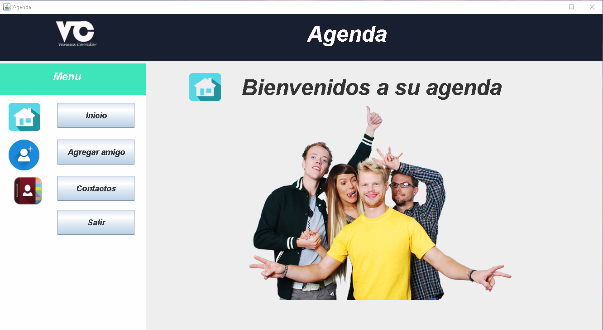
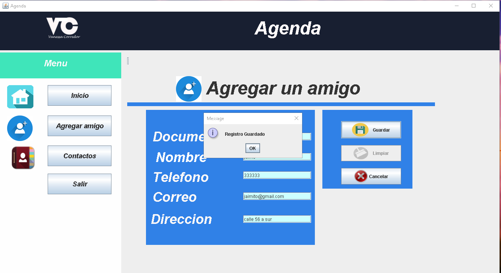
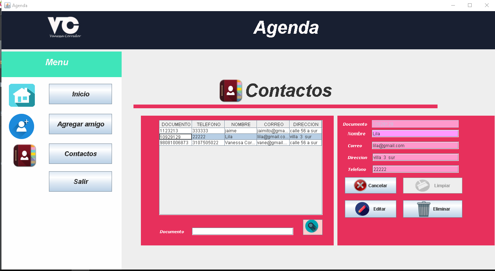

# Agenda basica de escritorio
-Arquitectura Mvc
-Conexion a base de datos Mysql 
-Crud

# Requrimientos
-Java
-Mysql

#Uso

-Importar base de datos "agenda_simple.sql"
-Dentro de la carpeta AgendaProfesor/Libreriasv estas las librerias,si te dice que un archivo falta lo abres desde ahi para resolverlo

